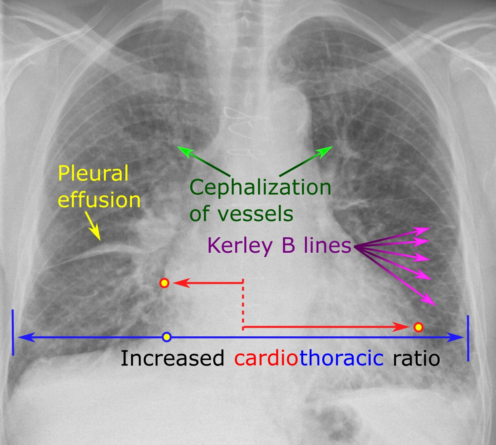

# Explainable AI applied to Edema Quantification

## Overview

Nowadays machine learning models and artificial intelligence approaches demonstrate superior performance in many domains including the biomedical sphere. However, the key problem of ML-based solutions is their weak interpretability compared to traditional solutions. In this connection, we deal with and solve this problem in relation to the assessment and classification of pulmonary edema on chest X-ray images. The proposed solution is aimed at the localization of [objective radiological signs](https://radiologyassistant.nl/chest/chest-x-ray/heart-failure) which are used for subsequent classification and assessment of different stages of pulmonary edema. In our solution, we are striving to get a fully [explainable AI](https://en.wikipedia.org/wiki/Explainable_artificial_intelligence) (XAI) solution that works as a “[white box](https://en.wikipedia.org/wiki/White_box_(software_engineering))”. In contrast to the “[black box](https://en.wikipedia.org/wiki/Black_box)” concept where even its designers cannot explain why an AI arrived at a specific decision, we are developing an explainable AI system that assists clinicians and radiologists in making decisions. During the development, we try to put the three key principles of XAI into our solution, namely transparency, interpretability, and explainability. In that regard, the proposed system is designed to detect and localize objective and explicit radiological patterns, visualize them, and assist clinicians in the decision-making process.

  

    Figure 1. A patient diagnosed with interstitial edema with detected and visualized objective radiological signs

