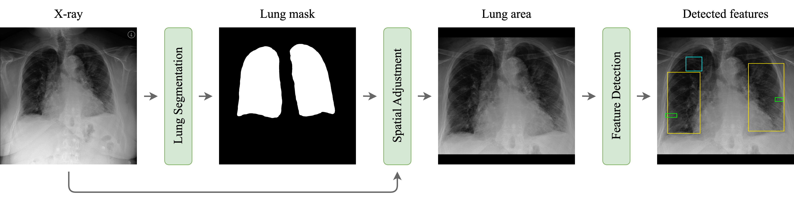
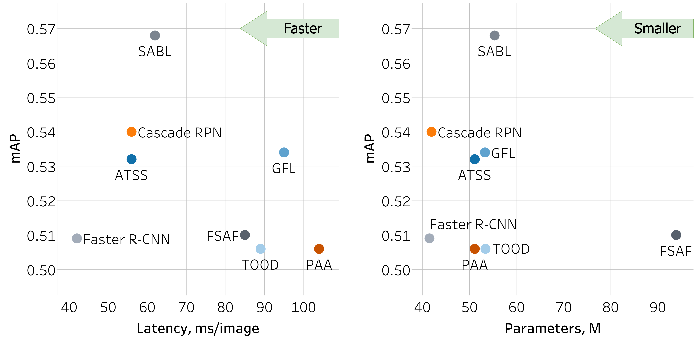
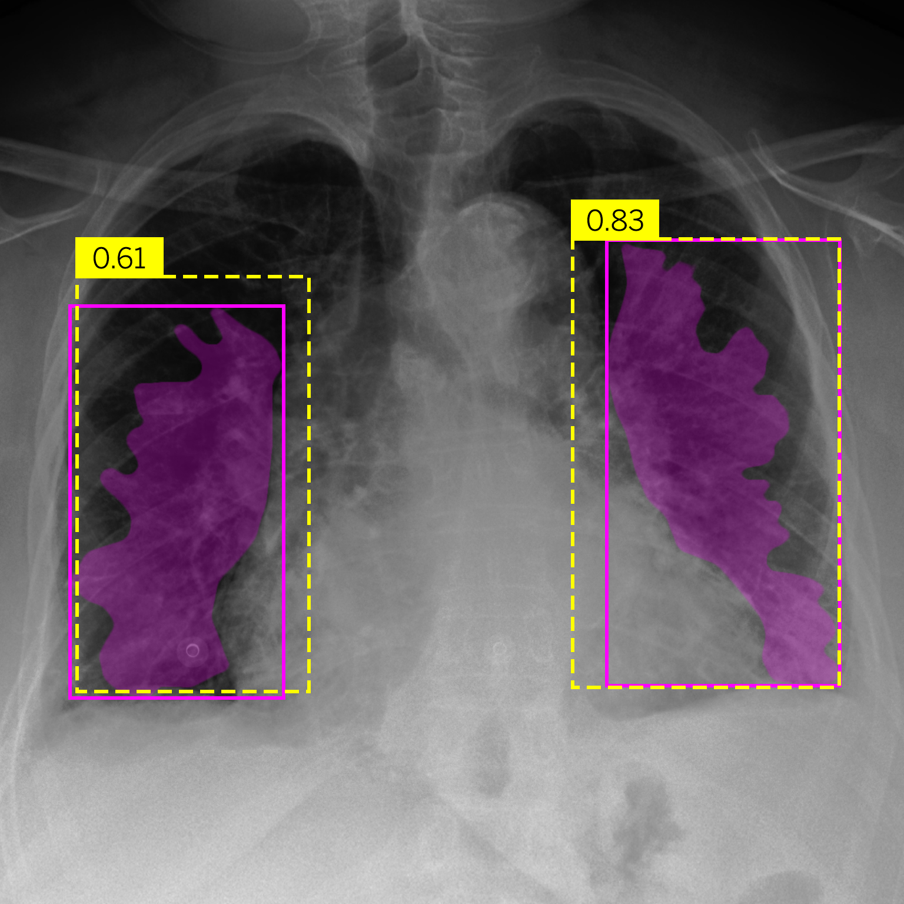
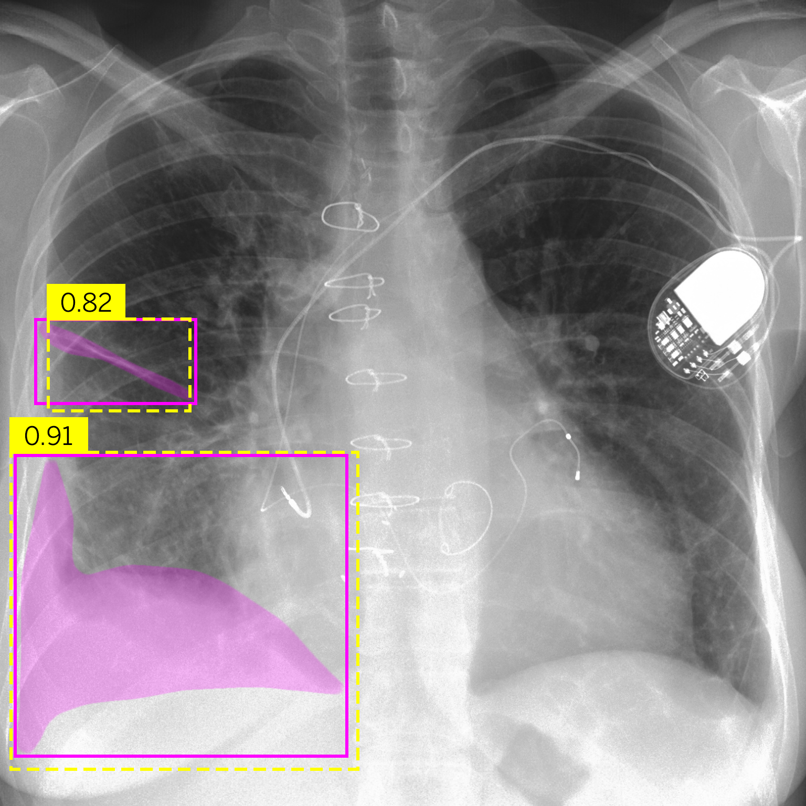

# Bridging the Gap: Explainable AI for Radiologists in the Detection and Classification of Radiographic Pulmonary Edema Features

## ℹ️ Purpose

This study aimed to develop a deep learning-based methodology for the detection and classification of radiographic features associated with pulmonary edema.

## ℹ️ Data and Methods

This retrospective study utilized a dataset from the MIMIC database comprising 1000 chest X-rays from 741 patients with suspected pulmonary edema. These images were manually annotated by an experienced radiologist, followed by lung segmentation using an ensemble of three segmentation networks. Subsequently, eight object detection networks were employed to identify radiological features categorized by severity. As a final step in the methodology, post-processing included box confidence filtering and soft non-maximum suppression. Descriptive statistics, including Average Precision (AP), mean Average Precision (mAP), and latency calculations, were used to evaluate performance, providing a comprehensive analysis of radiological features associated with pulmonary edema.

<p align="center">
  
</p>

<p align="left">
    Figure 1. Annotation methodology for chest X-rays. Various radiological features indicative of pulmonary edema are meticulously annotated for comprehensive analysis. Cephalization, representing the redistribution of blood flow in the upper lung fields, is delineated by cyan polylines. Kerley lines, indicating interstitial edema, are represented by green lines. Pleural effusions, characterized by accumulation of fluid in the pleural space, are highlighted in purple areas. Infiltrates, indicating alveolar edema or inflammation, are visualized by blue areas. Finally, bat wings, suggesting a butterfly pattern of alveolar edema, are highlighted in yellow areas. This detailed annotation method provides essential visual cues for accurate detection and analysis of radiological features.
</p>

<p align="center">
  
</p>

<p align="left">
    Figure 2. Schematic representation of the proposed approach. The original CXR is fed into the first segmentation stage where a lung mask is predicted. The CXR is then cropped using the lung mask and is further fed into detection stage to identify radiological features that can be used for further clinical analysis.
</p>

## ℹ️ Results

The [SABL](https://arxiv.org/abs/1912.04260) model emerged as the top performer, achieving the highest mAP of 0.568 and excelling in the detection of effusion, infiltrate and bat wings. Notably, the [TOOD](https://arxiv.org/abs/2108.07755) model demonstrated robust capabilities, particularly excelling in bat wing detection with an AP score of 0.918. The [Cascade RPN](https://arxiv.org/abs/1909.06720) and [GFL](https://arxiv.org/abs/2006.04388) models maintained consistently strong performance across all features. The [PAA](https://arxiv.org/abs/2007.08103) and [FSAF](https://arxiv.org/abs/1903.00621) models exhibited balanced performance, achieving mAP scores of 0.506 and 0.510, respectively. Surprisingly, the baseline [Faster R-CNN](https://arxiv.org/abs/1506.01497) model delivered competitive results with an mAP of 0.509. In addition, we evaluated the latency of these models, revealing processing times ranging from 42 ms to 104 ms per image. These latency values provide valuable insight into the real-time efficiency of each model, enhancing our understanding of their practical utility.

<p align="center">
  
</p>

<p align="center">
    Figure 3. Comparison of the networks based on their mAP scores, latency, and the number of parameters.
</p>

|  |  |
|:---------------------------------------:|:------------------------------------------------------:|
|                 (a) Bat                 |                      (b) Effusion                      |

<p align="center">
    Figure 4.Comparison of predictions and their confidences: ground truth (purple boxes and masks) vs. network predictions (yellow boxes).
</p>

## ℹ️ Conclusion

The proposed methodology effectively highlighted and classified pulmonary edema features, positioning it as a promising candidate for the development of a clinical support tool aimed at assisting radiologists in the diagnosis and severity assessment of pulmonary edema.

## ℹ️ Requirements

- Linux or macOS (Windows has not been officially tested)
- Python 3.8.x

## ℹ️ Installation

Step 1: Download and install Miniconda
``` bash
wget https://repo.anaconda.com/miniconda/Miniconda3-py38_22.11.1-1-Linux-x86_64.sh
chmod +x Miniconda3-latest-Linux-x86_64.sh
./Miniconda3-latest-Linux-x86_64.sh
```

Step 2: Clone the repository, create a conda environment, and install the requirements
``` bash
git clone https://github.com/quantori/edema-quantification.git
cd edema-quantification
chmod +x create_env.sh
source create_env.sh
```

## ℹ️ Data Access

1. To download the data, clone the repository:
``` bash
git clone https://github.com/quantori/edema-quantification.git
```

2. Install DVC:
``` bash
pip install dvc==2.58.2 dvc-s3==2.22.0
```

3. Download the datasets using DVC

Note: To download all datasets, models and research artifacts, we recommend using the [DVC framework](https://dvc.org/). However, the labeled dataset is also available on the Zenodo platform: https://zenodo.org/record/8383777.

|                                                                     Dataset                                                                      |                                                                                                                                         Description                                                                                                                                         | Size, Gb |                   Command                   |
|:------------------------------------------------------------------------------------------------------------------------------------------------:|:-------------------------------------------------------------------------------------------------------------------------------------------------------------------------------------------------------------------------------------------------------------------------------------------:|:--------:|:-------------------------------------------:|
|              [SLY](https://github.com/quantori/edema-quantification/blob/3ddc1120a8dd58ce970380ef189f9238a0872013/dvc/data/sly.dvc)              | This dataset consists of 1,000 chest X-rays obtained from 741 patients, annotated by an experienced clinician using the [Supervisely](https://supervisely.com/) platform. The annotations are stored in JSON format, and the images consist of stacked frontal and horizontal chest X-rays. |   8.2    |       ```dvc pull dvc/data/sly.dvc```       |
|            [Edema](https://github.com/quantori/edema-quantification/blob/3ddc1120a8dd58ce970380ef189f9238a0872013/dvc/data/edema.dvc)            |                                                     This dataset comprises 2,978 chest X-ray studies of patients diagnosed with pulmonary edema, sourced from the [MIMIC database](https://physionet.org/content/mimic-cxr-jpg/2.0.0/).                                                     |   12.4   |      ```dvc pull dvc/data/edema.dvc```      |
|   [Edema (stacked)](https://github.com/quantori/edema-quantification/blob/3ddc1120a8dd58ce970380ef189f9238a0872013/dvc/data/edema_stacked.dvc)   |                                                  This dataset consists of 3,816 stacked chest X-ray images of patients diagnosed with pulmonary edema, obtained from [MIMIC database](https://physionet.org/content/mimic-cxr-jpg/2.0.0/).                                                  |   31.3   |  ```dvc pull dvc/data/edema_stacked.dvc```  |
|          [Healthy](https://github.com/quantori/edema-quantification/blob/3ddc1120a8dd58ce970380ef189f9238a0872013/dvc/data/healthy.dvc)          |                                                                This dataset comprises 3,136 chest X-ray studies of healthy patients, sourced from the [MIMIC database](https://physionet.org/content/mimic-cxr-jpg/2.0.0/).                                                                 |   13.9   |     ```dvc pull dvc/data/healthy.dvc```     |
| [Healthy (stacked)](https://github.com/quantori/edema-quantification/blob/3ddc1120a8dd58ce970380ef189f9238a0872013/dvc/data/healthy_stacked.dvc) |                                                        This dataset consists of 4,269 stacked chest X-ray images obtained from healthy patients, obtained from [MIMIC database](https://physionet.org/content/mimic-cxr-jpg/2.0.0/).                                                        |   34.5   | ```dvc pull dvc/data/healthy_stacked.dvc``` |
|             [Intermediate](https://github.com/quantori/edema-quantification/blob/3ddc1120a8dd58ce970380ef189f9238a0872013/dvc.lock)              |                                                                                             These are intermediate datasets generated during the execution of the DVC data processing pipeline.                                                                                             |   10.2   |           ```dvc pull dvc.yaml```           |

Note: The labeled dataset is also available on the Zenodo platform: https://zenodo.org/record/8383777

# TODO: FIX models

4. Download the models using DVC

|                                                           Artifact                                                           |                                Description                                 | Size, Gb |                      Command                      |
|:----------------------------------------------------------------------------------------------------------------------------:|:--------------------------------------------------------------------------:|:--------:|:-------------------------------------------------:|
|        [Object detection results](https://github.com/ViacheslavDanilov/hsi_analysis/blob/main/dvc/models/mlruns.dvc)         | Results of training four different Faster R-CNN networks tracked by MLFlow |   0.67   |       ```dvc pull dvc/models/mlruns.dvc```        |
|       [Clustering results](https://github.com/ViacheslavDanilov/hsi_analysis/blob/main/dvc/clustering/mean_shift.dvc)        |    Segmentation of hyperspectral images using the Mean Shift algorithm     |   19.6   |   ```dvc pull dvc/clustering/mean_shift.dvc```    |
|  [Faster R-CNN (PCA + Abs)](https://github.com/ViacheslavDanilov/hsi_analysis/blob/main/dvc/models/FasterRCNN_pca_abs.dvc)   |         Faster R-CNN model trained on the PCA + Absorbance dataset         |   0.33   |    ```dvc dvc/models/FasterRCNN_pca_abs.dvc```    |
|  [Faster R-CNN (PCA + Ref)](https://github.com/ViacheslavDanilov/hsi_analysis/blob/main/dvc/models/FasterRCNN_pca_ref.dvc)   |        Faster R-CNN model trained on the PCA + Reflectance dataset         |   0.33   | ```dvc pull dvc/models/FasterRCNN_pca_ref.dvc```  |
| [Faster R-CNN (t-SNE + Abs)](https://github.com/ViacheslavDanilov/hsi_analysis/blob/main/dvc/models/FasterRCNN_tsne_abs.dvc) |        Faster R-CNN model trained on the t-SNE + Absorbance dataset        |   0.33   | ```dvc pull dvc/models/FasterRCNN_tsne_abs.dvc``` |
| [Faster R-CNN (t-SNE + Ref)](https://github.com/ViacheslavDanilov/hsi_analysis/blob/main/dvc/models/FasterRCNN_tsne_ref.dvc) |       Faster R-CNN model trained on the t-SNE + Reflectance dataset        |   0.33   | ```dvc pull dvc/models/FasterRCNN_tsne_ref.dvc``` |

NOTE: Since data storage is organized through AWS S3, you should first request access to this repository by configuring your AWS credentials.
